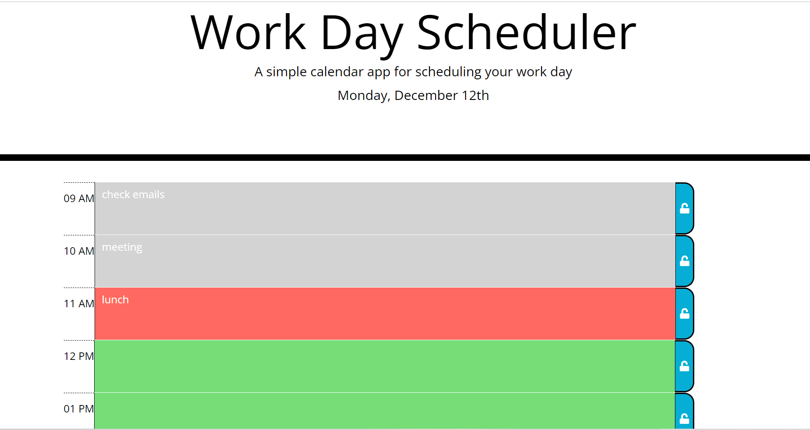

# DailyPlannerApp

## Deployed Link
https://sanjana-1604.github.io/DailyPlannerApp/

## Description

Cretaed a daily planner to save and create tasks for the day. It will help in managing the tasks more efficiently and will help in getting a productive day. During the coding process I learned how ot use moment.js with all the diffrent formats and use LocalStorage to save the tasks.

## Usage
Can be used to enter the list of all the tasks and attach them to particular time of the day.

## License
Please refer the license section for details